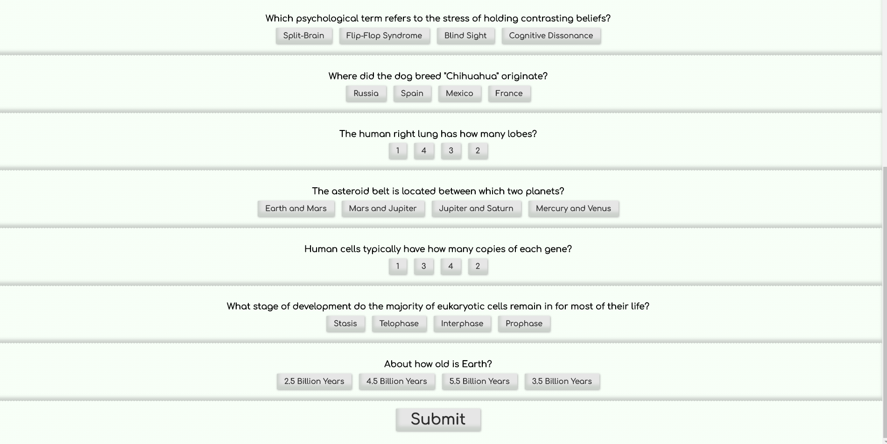
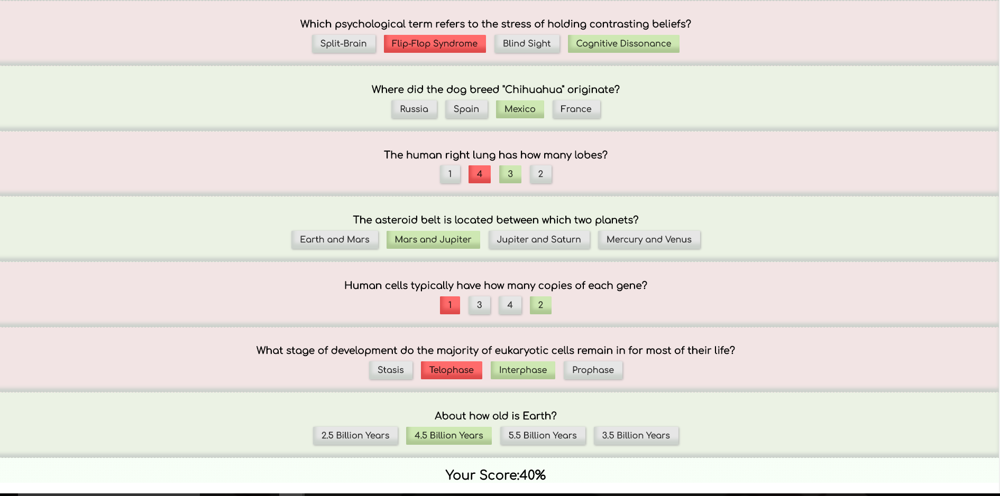

## What is Quizical?

Its a quiz app with a hidden user backbone running on Express, React/Redux, and the Open Trivia Database.  Quizzes are generated in a given category, you are scored on your work, and then that data is pushed to the database.

Hidden from view, when you go to the page for the first time, the server is queried and an id assigned for you.  That is written into a cookie which gets read at the start of each session.  When getting or updating the user's stats, that id is used to query the database.  It leads to a seamless user-driven experience backed by a robust PostGreSQL database.

## ScreenShots

### Homepage

### A Quiz

### User History

### Technology Used
* React/redux
* Express
* PureCss
* PostGreSQL
* Open Trivia Database
